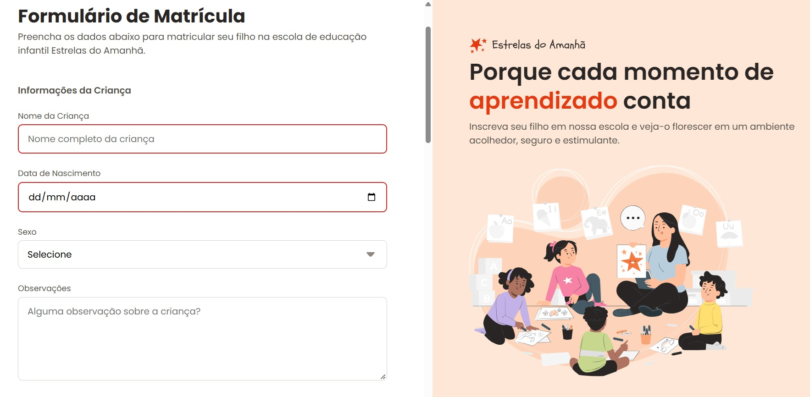
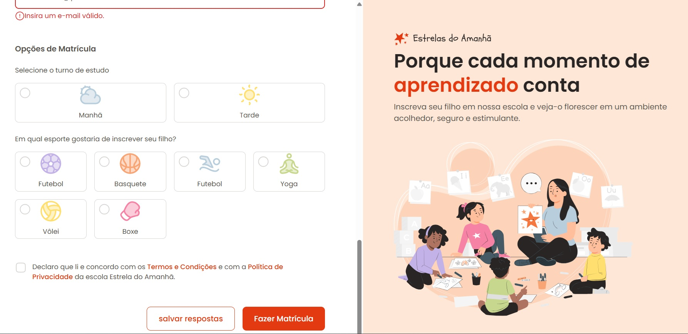

<h1 align="center"> Formulário de Matrícula </h1>

Aplicação desenvolvida por Wagner Fagundes em treinamento para aprendizado e aperfeiçoamento em tecnologias WEB.  
<a href="https://wbd01.github.io/Formulario-Matricula/">Veja o projeto finalizado e documentação através deste link.</a>

  

 

  
  

## 🚀 Tecnologias

Esse projeto foi desenvolvido com as seguintes tecnologias:

- HTML e CSS
- Git e Github
- Figma

## 💻 Projeto

Trata-se de um formulário de Matrícula que pode ser usando em escolas infantis.

- [Acesse o projeto finalizado, online](https://wbd01.github.io/Formulario-Matricula/)

## :memo: Licença

Esse projeto está sob a licença MIT.

---

Feito com ♥ by Wagner Fagundes
